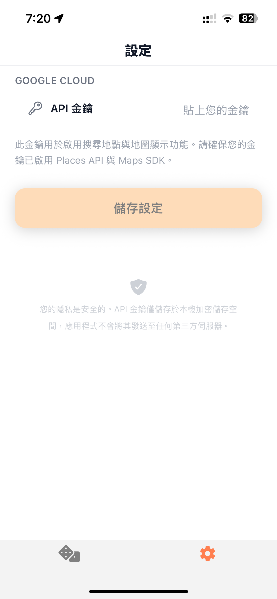
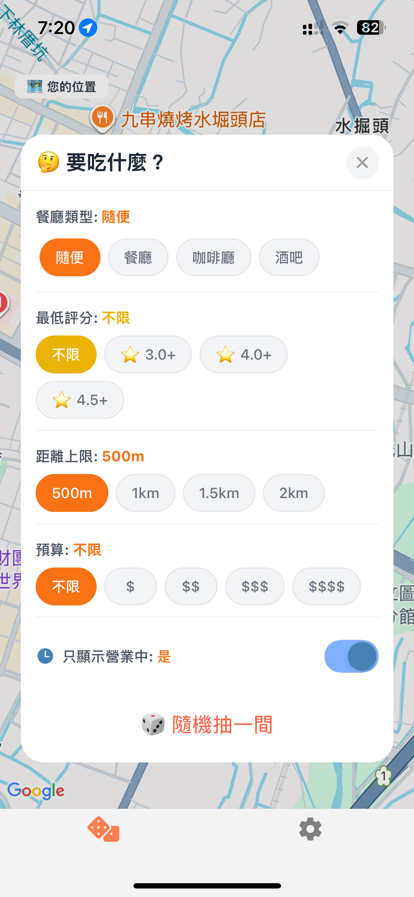
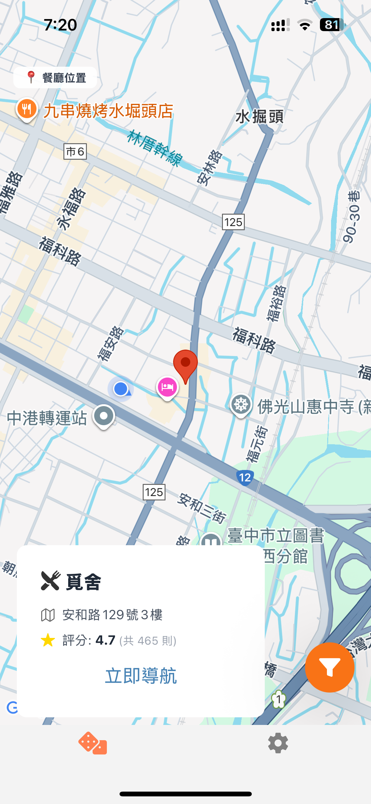
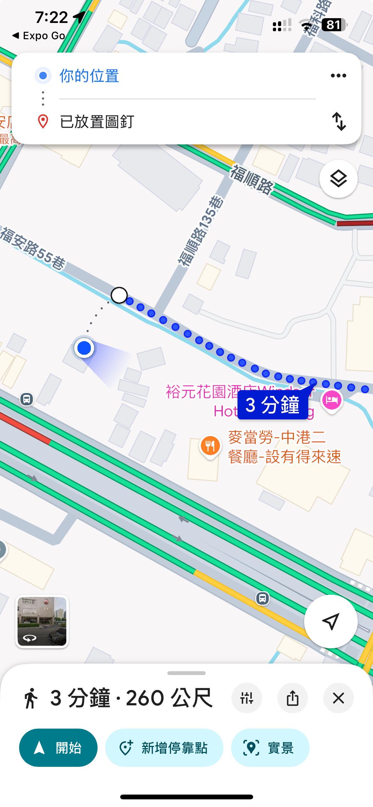

# 🎲 Food Roulette: What to Eat?
[](LICENSE)
[](https://expo.dev/)

## App Description
A simple app that helps you decide what to eat by picking a random restaurant based on your location and preferences.

1. Before picking a restaurant, please set your Google Cloud API Key in the Settings page.


2. You can apply filters such as distance, price level, and more.


3. The system will randomly select a restaurant that matches your filters.


4. You can navigate to the selected restaurant using Google Maps.


## Get started
Recommended Node.js version: v20.19.6
1. Install dependencies

   ```bash
   npm install
   ```

2. Start the app

   ```bash
   npx expo start
   ```

3. Download the **Expo Go** app on your mobile device.
Scan the QR code displayed in your terminal or browser — and you’re ready to go!